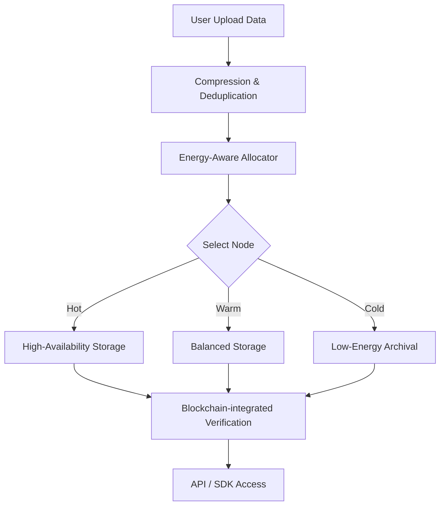

# RANTAI Sentinel

💾

Decentralized Storage Optimizer for Sustainable Web3

RANTAI GreenStorage adalah solusi penyimpanan terdesentralisasi yang dirancang untuk hemat energi, aman, dan efisien.
Proyek ini mendukung komunitas RANTAI dengan menyediakan infrastruktur penyimpanan data yang ramah lingkungan.
---

## Core Features

- Data Compression & Deduplication
Mengurangi redundansi dan ukuran data yang disimpan agar lebih efisien.

- Energy-Aware Storage Allocation
Memilih node penyimpanan berdasarkan sumber energi terbarukan serta intensitas karbon yang rendah.

- Blockchain-integrated Verification
Menggunakan hash & smart contract untuk memverifikasi integritas data tanpa menyimpan data penuh di blockchain.

- Tiered Storage Model
Penyimpanan hot, warm, dan cold sesuai kebutuhan availability dan konsumsi energi.

- API & SDK
Mendukung integrasi dengan layanan cloud & storage terdesentralisasi seperti IPFS/Filecoin atau alternatif lainnya.

---

## Flow Diagram

---

## Kontribusi

Kontribusi sangat kami sambut! Silakan ikuti langkah berikut:

- Fork repository

- Buat branch fitur baru: git checkout -b feature/nama-fitur

- Commit perubahan Anda: git commit -m 'Tambah fitur baru'

- Push ke branch Anda: git push origin feature/nama-fitur

- Buat pull request di repository ini

- Harap pastikan kode teruji dan mengikuti style yang sudah ada.

---

## Lisensi

Proyek ini dilisensikan di bawah MIT License - baca file LICENSE untuk informasi lebih lanjut.
